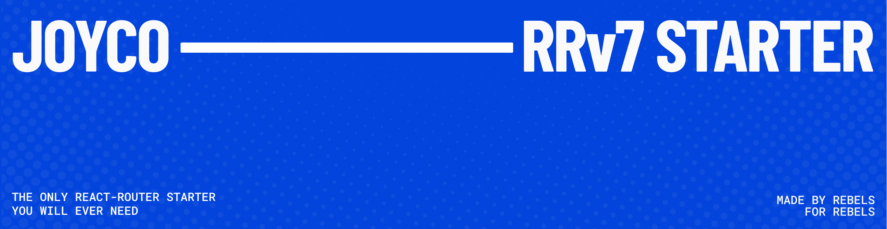

# &nbsp;&nbsp;JOYCO RRv7

The JOYCO `React Router v7` + `React 19` + `React Compiler` ready template to power your next project.

## Features

- 🚀 Quick Setup
- ⚛ React 19 + React Compiler Ready
- 🤓 Preconfigured Eslint + Prettier
- 🪄 Page Transitions
- 🦸‍♂️ GSAP Setup
- 🖌️ Tailwind Setup
- ▲ Vercel Compatible
- 🔎 Bundle Analyzer

## Handy utils
- `generateMeta()` at `/app/lib/meta` | Generates meta tags through a type safe interface with great defaults.
- `generateLinks()` at `/app/lib/links` | Same as above but for link tags, optimized for fonts, prefetching and essential page data.